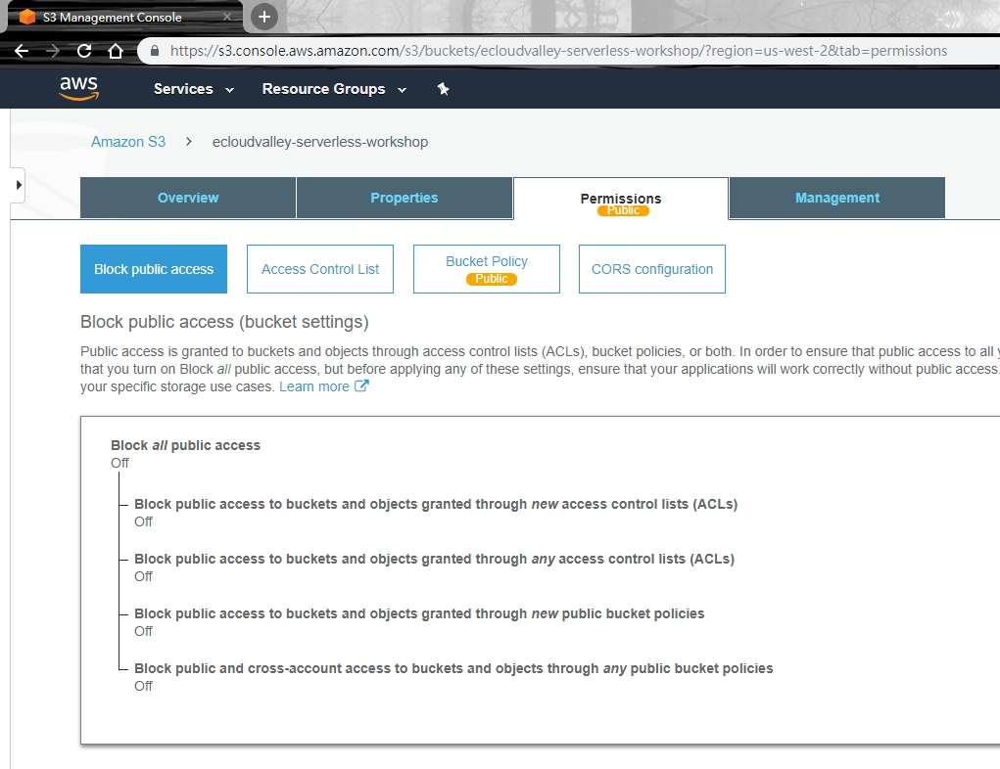
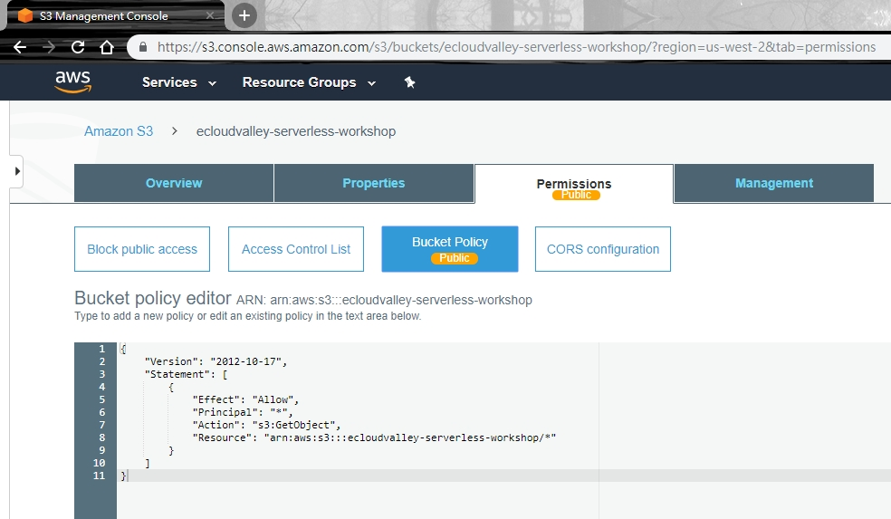
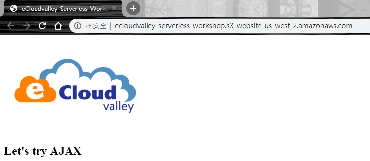

# Amazon S3 Static Website Hosting
1. AWS console -> Services -> Amazon S3
2. Click "Create bucket"
3. Bucket name "Take it by yourself"
4. Click "Create"
5. Click "Properties" Tabs
6. Click "Static website hosting"
7. Choose "Use this bucket to host a website"
8. Input Index document "index.html"
9. Input Error document "error.html"
10. Click "Save"
11. Upload files "index.html" & "error.html"
12. Click "Static website hosting Endpoint":[Endpoint](http://ecloudvalley-serverless-workshop.s3-website-us-west-2.amazonaws.com/) and you can see http 403 error "AccessDenied"

13. Click "Permissions" Tabs
14. Click "Block public access"
15. Click "Edit"
16. Unclick "Block all public access"
17. Click "Save"

18. Click "Bucket Policy"
19. Input Json(xxxxxx is your bucket name)
```json
{
    "Version": "2012-10-17",
    "Statement": [
        {
            "Effect": "Allow",
            "Principal": "*",
            "Action": "s3:GetObject",
            "Resource": "arn:aws:s3:::xxxxxx/*"
        }
    ]
}
```

20. Click "Save"
15. Access Static website hosting Endpoint Again
16. The Website can display normally now
