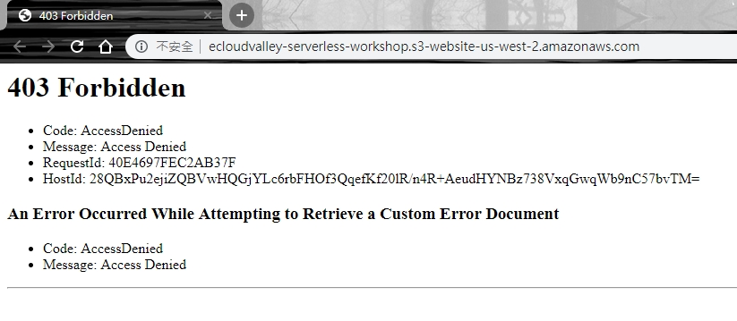

# Amazon S3 Static Website Hosting
1. AWS console -> Services -> Amazon S3
2. Create bucket -> Bucket name -> Create
3. Properties Tabs -> Static website hosting -> Use this bucket to host a website -> Input Index document "index.html" -> Input Error document "error.html" -> Click Save
4. Upload files "index.html" & "error.html"
5. Click Static website hosting Endpoint -> You can see http 403 error "AccessDenied"

6. Permissions Tabs -> Block public access -> Edit -> Unclick "Block all public access" -> Click Save

7. Bucket Policy -> xxxxxx is your bucket name -> Click Save
```json
{
    "Version": "2012-10-17",
    "Statement": [
        {
            "Effect": "Allow",
            "Principal": "*",
            "Action": "s3:GetObject",
            "Resource": "arn:aws:s3:::xxxxxx/*"
        }
    ]
}
```

8. Access Static website hosting Endpoint Again
9. The Website can display normally now
