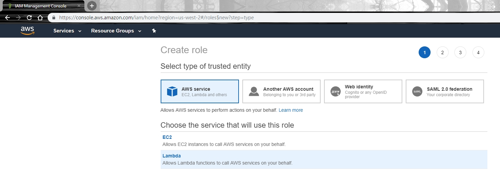
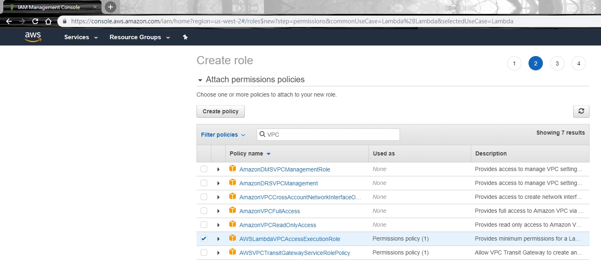

# AWS IAM Role
1. AWS console -> Services -> IAM
2. Click "Roles"
3. Click "Create Role"
4. Choose "AWS Service"
5. Click "Lambda"
6. Click "Next:Permissions"

7. Select Policy "AWSLambdaVPCAccessExecutionRole"
8. Click "Next:Tags"

9. Input Role name "aws-lambda-service-role"
10. Click "Create role"