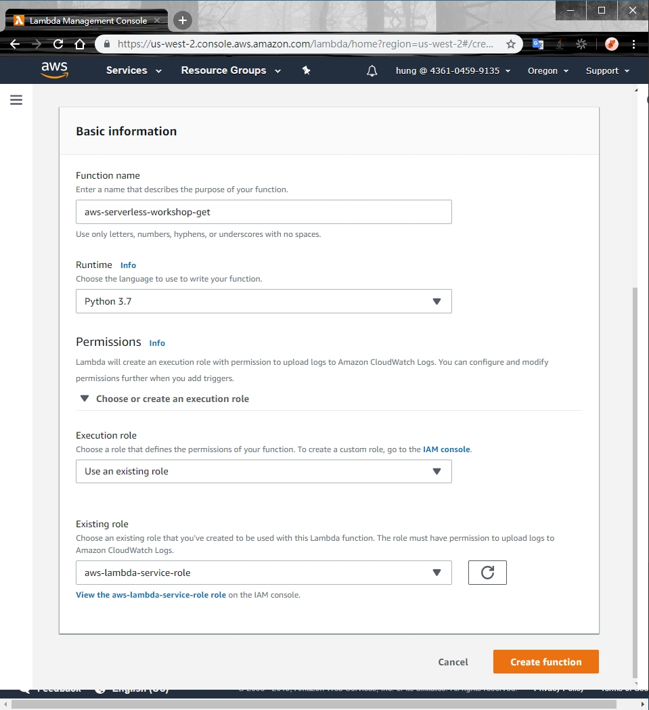
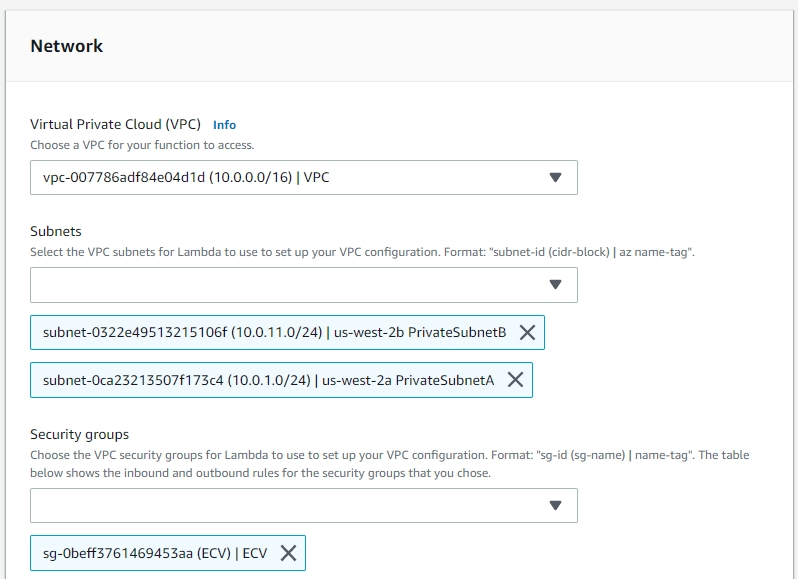
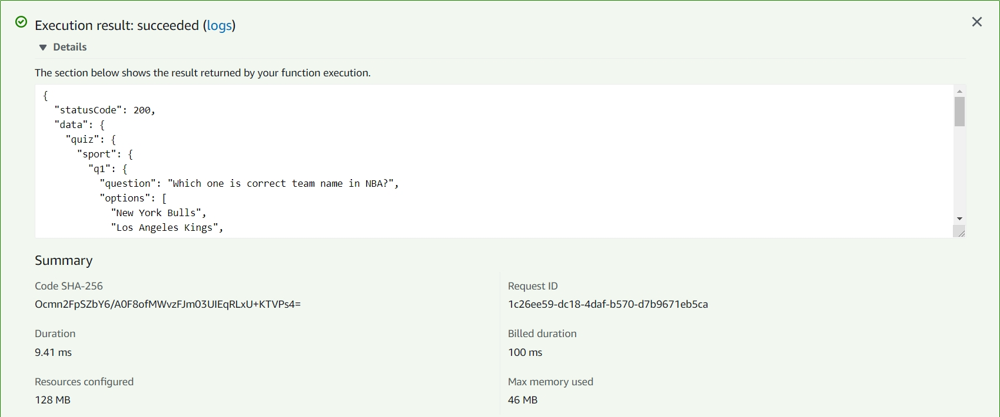

# AWS Lambda
1. AWS console -> Services -> Lambda
2. Click "Create function"
3. Input Function Name "aws-serverless-workshop-get"
4. Choose Runtime "Python 3.7"
5. Choose Execution role "Use an existing role"
6. Choose Existing role "aws-lambda-service-role"
7. Click "Create function"

8. Setting Lambda Environment
   * Environment variables
   * Tags
   * Execution role
   * Basic settings
   * Network
   * Debugging and handling
   * Concurrency

9. Write your Code on Lambda
10. Click "Save"
11. Click "Test"
12. Choose "Create new test event"
13. Input Event name "demo"
14. Click "Create"
15. Click "Test"

16. Create another Lambda function name "aws-serverless-workshop-post"