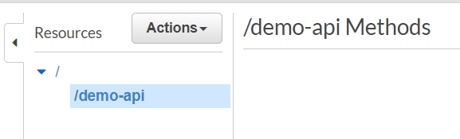
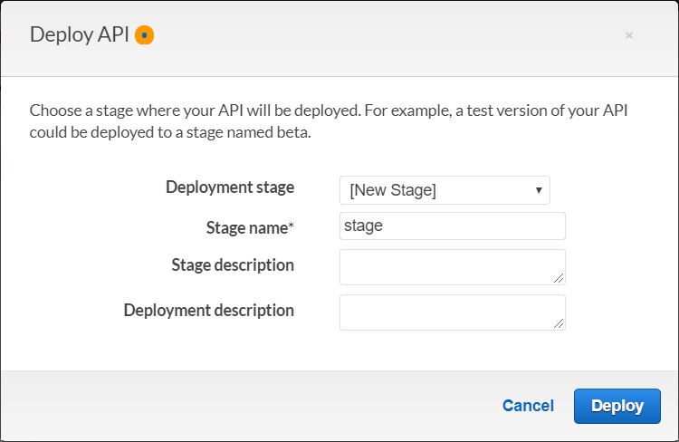

# Amazon API Gateway
1. AWS console -> Services -> API Gateway
2. Click "Create API"
3. Choose the protocol "REST"
4. Choose "New API"
5. Input API name "aws-serverless-workshop"
6. Input Description "aws-serverless-workshop"
7. Choose Endpoint Type "Regional"
8. Click "Create API"

9. Click "Actions"
10. Click "Create Resource"
11. Input Resource Name "demo-api"
12. Input Resource Path "demo-api"
13. Click "Create resource"

14. Click "/demo-api"
15. Click "Actions"
16. Click "Create Method"
17. Choose "GET"

18. Input Lambda Function Name "aws-serverless-workshop-get"

19. Click "Save"
20. Click "Actions"
21. Click "Deploy API"
22. Choose Deployment stage "[New Stage]"
23. Input Stage name "stage"
24. Click "Deploy"

25. You can get the Invoke URL[URL](https://pj8ep90b5m.execute-api.us-west-2.amazonaws.com/stage)

26. Now, you can try to access API by Postman

2. Click Create function
3. Input Function Name "aws-serverless-workshop-get" -> Choose Runtime "Python 3.7" -> Choose Execution role "Use an existing role" -> Choose Existing role "aws-lambda-service-role" -> Click "Create function"

4. Setting Lambda Environment
   * Environment variables
   * Tags
   * Execution role
   * Basic settings
   * Network
   * Debugging and handling
   * Concurrency

5. Write your Code on Lambda
6. Click "Save"
7. Click "Test" -> Create new test event -> Input Event name "demo" -> Create -> Click Test

8. Create another Lambda function name "aws-serverless-workshop-post"