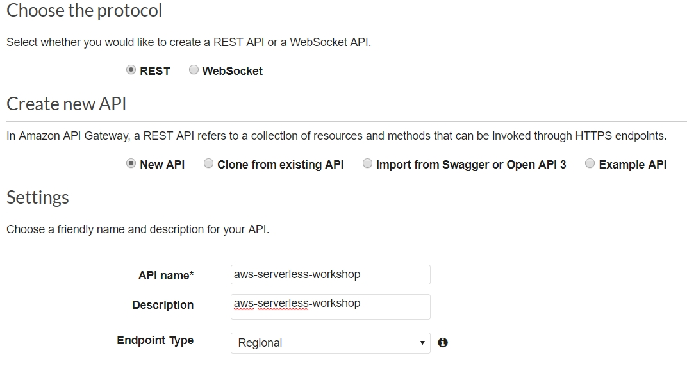

# HTML call API Gateway
1. AWS console -> Services -> API Gateway
2. Click "Create API"
3. Choose the protocol "REST"
4. Choose "New API"
5. Input API name "aws-serverless-workshop"
6. Input Description "aws-serverless-workshop"
7. Choose Endpoint Type "Regional"
8. Click "Create API"

9. Click "Actions"
10. Click "Create Resource"
11. Input Resource Name "demo-api"
12. Input Resource Path "demo-api"
13. Click "Create resource"

14. Click "/demo-api"
15. Click "Actions"
16. Click "Create Method"
17. Choose "GET"

18. Input Lambda Function Name "aws-serverless-workshop-get"

19. Click "Save"
20. Click "Actions"
21. Click "Deploy API"
22. Choose Deployment stage "[New Stage]"
23. Input Stage name "stage"
24. Click "Deploy"

25. You can get the Invoke URL:[URL](https://pj8ep90b5m.execute-api.us-west-2.amazonaws.com/stage/demo-api)

26. Now, you can try to GET the API by Postman

27. Create another Method "POST" and Lambda Function "aws-serverless-workshop-post"
28. Click "Actions"
29. Click "Deploy API"
30. Click "Deploy"
31. You can try to POST the API by Postman
