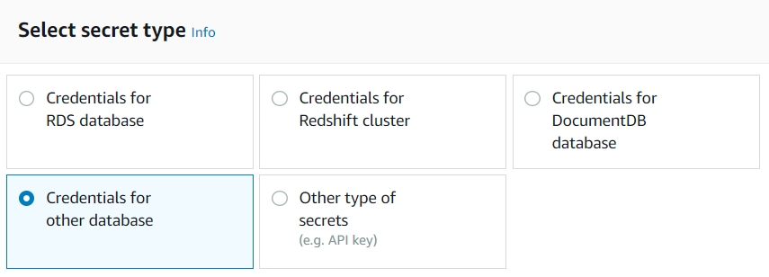
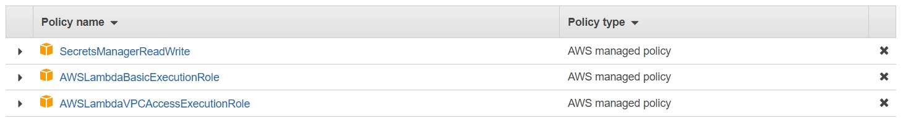
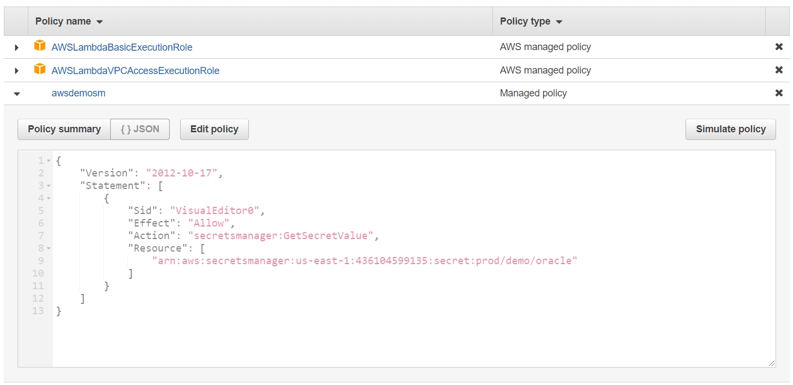
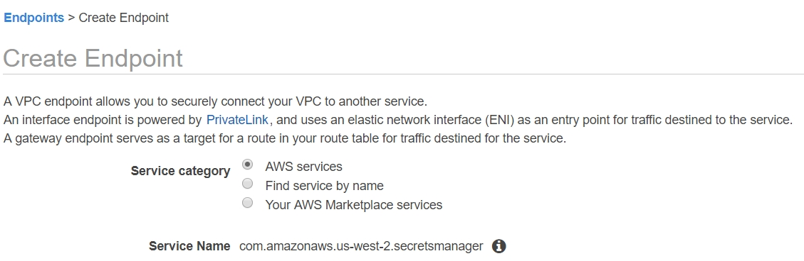
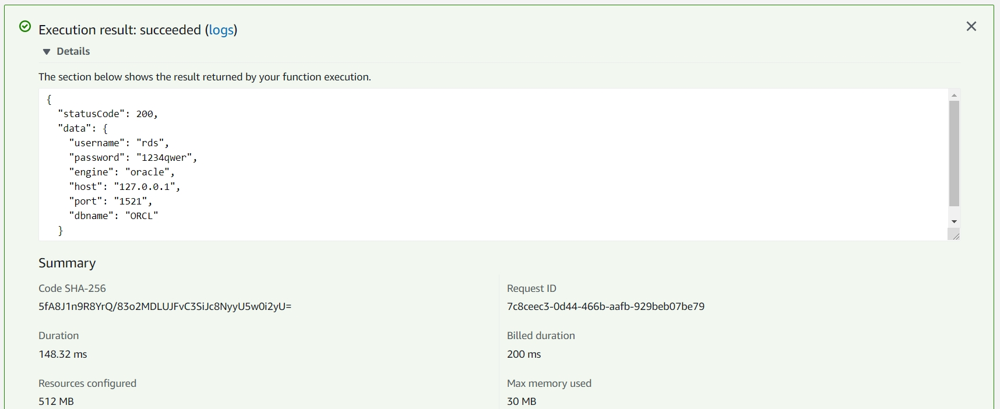

# AWS Secrets Manager
## Create AWS Secrets Manager
1. AWS console -> Services -> Secrets Manager
2. Click "Store a new secret"
3. Select "Credentials for other database"

4. Input "User name"
5. Input "Password"
6. Select AWS KMS encryption key
7. Select Database Engine "Oracle"
8. Input "Server address"
9. Input "Database name"
10. Input "Port"
11. Click "Next"
12. Input Secret name ex. "prod/demo/oracle"
13. Click "Next"
14. Click "Store"

## Prepare AWS Environment
When you start testing AWS Secrets Manager, you must to check your AWS environment.
1. IAM
2. Network
### IAM
1. AWS managed Policy "SecretsManagerReadWrite"

2. Customer managed Policy
```json
{
    "Version": "2012-10-17",
    "Statement": [
        {
            "Sid": "VisualEditor0",
            "Effect": "Allow",
            "Action": "secretsmanager:GetSecretValue",
            "Resource": [
                "arn:aws:secretsmanager:us-east-1:<aws-id>:secret:<secret-name>"
            ]
        }
    ]
}
```

### Network
1. NAT Gateway
2. VPC Endpoint


## Test AWS Secrets Manager
```python
# Use this code snippet in your app.
# If you need more information about configurations or implementing the sample code, visit the AWS docs:   
# https://aws.amazon.com/developers/getting-started/python/

import boto3
import base64
from botocore.exceptions import ClientError


def get_secret():

    secret_name = "prod/demo/oracle"
    region_name = "us-west-2"

    # Create a Secrets Manager client
    session = boto3.session.Session()
    client = session.client(
        service_name='secretsmanager',
        region_name=region_name
    )

    # In this sample we only handle the specific exceptions for the 'GetSecretValue' API.
    # See https://docs.aws.amazon.com/secretsmanager/latest/apireference/API_GetSecretValue.html
    # We rethrow the exception by default.

    try:
        get_secret_value_response = client.get_secret_value(
            SecretId=secret_name
        )
    except ClientError as e:
        if e.response['Error']['Code'] == 'DecryptionFailureException':
            # Secrets Manager can't decrypt the protected secret text using the provided KMS key.
            # Deal with the exception here, and/or rethrow at your discretion.
            raise e
        elif e.response['Error']['Code'] == 'InternalServiceErrorException':
            # An error occurred on the server side.
            # Deal with the exception here, and/or rethrow at your discretion.
            raise e
        elif e.response['Error']['Code'] == 'InvalidParameterException':
            # You provided an invalid value for a parameter.
            # Deal with the exception here, and/or rethrow at your discretion.
            raise e
        elif e.response['Error']['Code'] == 'InvalidRequestException':
            # You provided a parameter value that is not valid for the current state of the resource.
            # Deal with the exception here, and/or rethrow at your discretion.
            raise e
        elif e.response['Error']['Code'] == 'ResourceNotFoundException':
            # We can't find the resource that you asked for.
            # Deal with the exception here, and/or rethrow at your discretion.
            raise e
    else:
        # Decrypts secret using the associated KMS CMK.
        # Depending on whether the secret is a string or binary, one of these fields will be populated.
        if 'SecretString' in get_secret_value_response:
            secret = get_secret_value_response['SecretString']
        else:
            decoded_binary_secret = base64.b64decode(get_secret_value_response['SecretBinary'])
            
    # Your code goes here. 
```
The sample code is [here](./sample-code.py).
