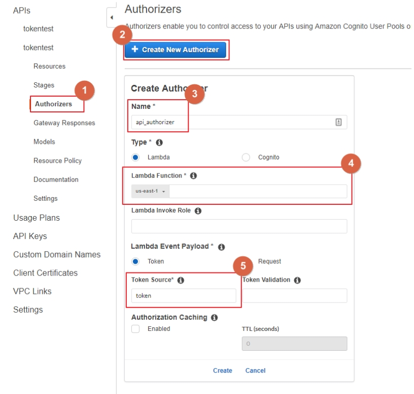
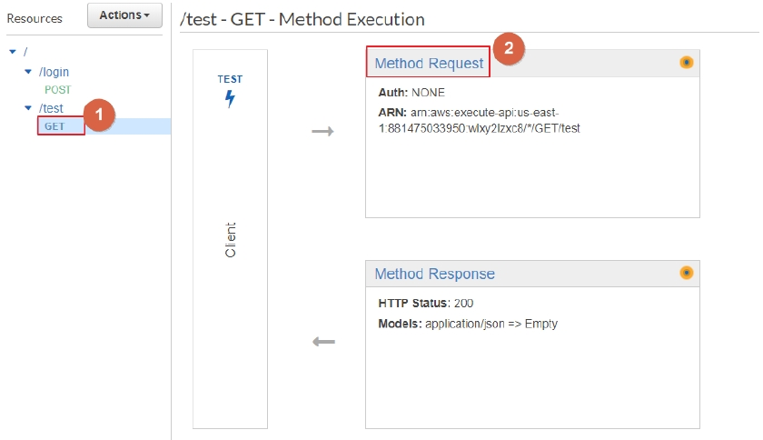
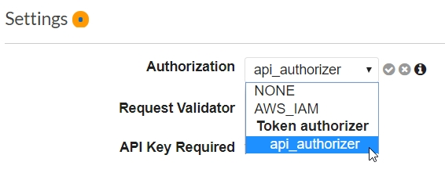

# Amazon API Gateway JWT Authorizers

There are two types of Lambda authorizers:
1. token-based Lambda authorizer: For JSON Web Token or OAuth token
2. request parameter-based Lambda authorizer: For WebSocket APIs

## Lambda Authorizers workflow

## Tutorial
1. Create "Autherizer" Lambda Function 
* Function Name "apigw_token_authorizer"
* Runtime "Node.js 10.x"
* Upload Lambda zip "apigw_token_authorizer.zip"
* Input Environment Variables "JWT_SECRET" "IMP"

2. Create "Login" Lambda Function
* Function Name "jwt_login"
* Runtime "Node.js 10.x"
* Upload Lambda zip "jwt_login_test.zip"
* Input Environment Variables "JWT_SECRET" "IMP"
3. Setting Amazon API Gateway Login
* Create Resource
* Path Name "login"
* Click "OK"
* Create Method
* Choose "POST"
* Input Lambda Function "jwt_login"
* Click "Save"
4. Setting Amazon API Gateway Authorizer
* Click "Authorizers"
* Click "Create New Authorizer"
* Input Name "api_authorizer"
* Input Lambda Function "apigw_token_authorizer"
* Input Token Source "token"
* Click "Create"

* Click API Name
* Click Method Request

* Choose Authorization "api_authorizer"

5. Deploy API