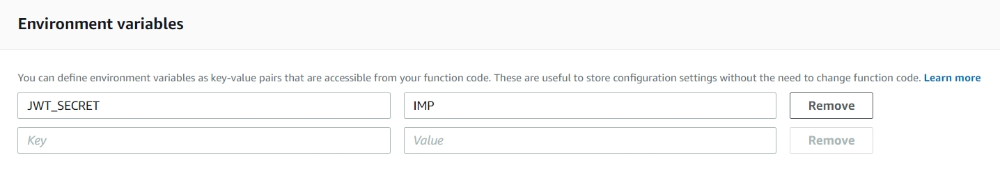

# Amazon API Gateway JWT Authorizers

There are two types of Lambda authorizers:
1. token-based Lambda authorizer: For JSON Web Token or OAuth token
2. request parameter-based Lambda authorizer: For WebSocket APIs

## Lambda Authorizers workflow

##
1. Create "Autherizer" Lambda Function 
* Function Name "apigw_token_autherizer"
* Runtime "Node.js 10.x"
* Upload Lambda zip "apigw_token_autherizer.zip"
* Input Environment Variables "JWT_SECRET" "IMP"
